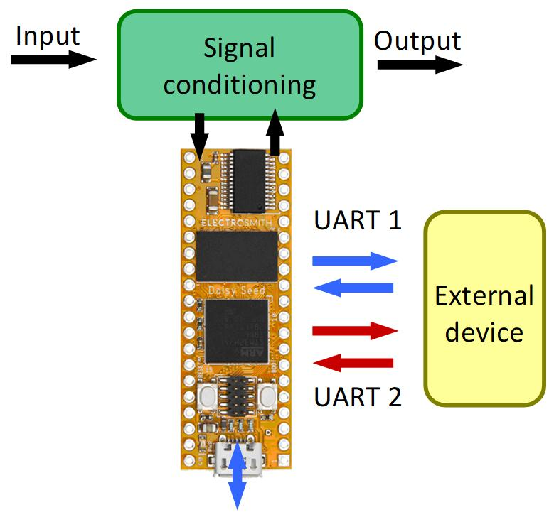

# GSP
## Multi-Effect Guitar Sound Processing

### 1. Overview

GSP_EM comprises all possible effects algorithms to be included in the chain. GSP_ML has the main loop that provides ADC readings and DAC writings, as well as initialization of software modules and hardware. 
EM and ML modules run on Daisy Seed only. The following two (control commands and potentiometer) need part of software to run off DS. The last one runs off DS only. All modules will be described in proper documentation.
The Guitar Sound Processing (GSP) is a multi-effect platform suited to stage performance, based on Electrosmith Daisy Seed. Its main highlights are:

  -	Easy using and easy effect setup changing
  -	Configurable effect sequence
  -	Chain sequences and setup stored in non-volatile memory
  -	Minimum lag time (latency)
  -	CD audio quality
  -	Wireless support for pedal switching, volume and effect configuration

GSP can be configured by commands in ASCII format through serial lines or USB. To accomplish for the minimum lag time, all the effects process audio signal in real time. CD audio quality means that the adopted sampling rate is equal or greater than 44.1 kHz, which restricts the lag time to less than 0.03 ms. Wireless communication can be established by interfacing the Daisy Seed (DS) with any external device by serial line (UART), like ESP32 WROVER or WROOM modules. These devices may also incorporate Blue Tooth, Wireless (IOT), and Flash SSD support for effect configuration storage. Additional peripherals can also be attached, like nRF24L01 modules, for example, to provide interfaces with expression pedals.

GSP comprises hardware and software. The GSP Driver is composed by an ElectroSmith Daisy Seed board, and a customized electronics. The software is based on libDaisy library. Figure below shows the expected GSP connections available for peripheral interfaces. The GSP Driver shall receive configuration commands coming from a PC computer through USB line, WiFi or Blue Tooth (BT), as well as from smartphones with BT, or a customized GSP console (yet to be developed) connected by USB line or BT. Action pedals (potentiometer or any variable voltage source) shall be directly attached to GSP Driver, or by Blue Tooth interface. 

Next figure shows the GSP internal block. The input signal from guitar is conditioned by an analog electronics that amplifies the signal and applies an analogue compressor before being sent to ADC converter of Daisy Seed. After being processed the signal is delivered back to the electronics for amplification and analog expander. DS communicates with external devices by two serial lines: one to send and to receive commands and other to receive expression pedal data. The external device can be a ESP32, for instance, which provides direct access to BT drivers or any microcomputer such as Arduino. They can interface with nRF24L01 module to receive wireless data from expression pedals. These pedals must have a microprocessor with nRF24L01 incorporated to process and send potentiometer data to GSP. The multi-effect GSP can also be commanded by USB either through DS (except for stored configurations) or an external device, yet to be developed. The effects setup and chain configuration can be stored in SSD in the external device. Here the name “chain” will be used to indicate the effect sequence order, sometimes also named as signal path, pedal board, or guitar rig. 

Not all the configuration or setup commands are rendered on Daisy Seed. In fact, due to flash memory savings, DS does not store any kind of configuration; it only interprets the Effects and Chains Commands, as can be seen in next figure. Some external device, like Arduino or ESP32, with support to SSD memory, are required to store and retrieve the effects and chains configuration from previously data written on flash. The external device shall also provide wireless communication with the application software running on a PC or Smart Phone, and serial link to DS to send Chain and Effect Commands. Also, as the figure shows, another device with proper software application is needed to handle high level setups and to provide easy human interface. The application will handle with several Playlists, which are collection of Songs, which, in turn, are collections of Chains (normally just one, but sometimes two). Chains are collections of Effects (like Chorus, Phaser, etc.) and, finally, some Setups can be stored to be used directly by the Effects. The number of members in each level is limited by the memory available on the application software. Once programmed, it is just a matter of selecting the desired Playlist, and, following that, just one click to change the Song or the Chain in a given Song. All the Chain and Effect configuration will be automatically uploaded seamless on Daisy Seed, including Volume or Expression pedal.

GSP has several software modules. These modules can be selected to achieve a desired solution or configuration. For instance, there are modules to provide interpreted commands for chain configuration, or to print and to read console commands. The modules are grouped in

  -	GSP_EM - effect modules
  -	GSP_ML - main loop
  -	GSP_CC - control commands
  -	GSP_PT - potentiometer modules
  -	GSP_CH - chain configuration

